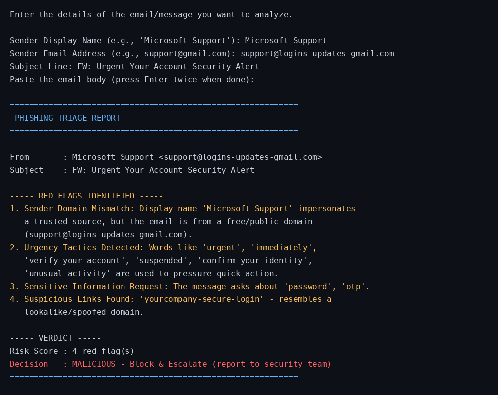

🔐 Project 3: Phishing Awareness Analysis

A Python-based Phishing Triage Tool that analyzes email details
(sender, subject, and body) to detect red flags, identify suspicious
links/keywords, and give a clear risk-based verdict (Safe / Suspicious /
Malicious).

## 📌 Project Overview

This project analyzes sample emails or messages to identify phishing
attempts. It inspects the sender information, subject line, and body
text for common social-engineering red flags, then produces a risk
score and a clear triage decision — helping bridge the gap between
human error and system security through analytical logic.

## 🎯 Goal

Analyze sample emails or messages to identify phishing attempts.

## ✅ Features

* 🕵️ Detects sender/display-name domain mismatch (e.g., "Microsoft
  Support" sent from a free Gmail address)
* ⏱️ Detects urgency and pressure-tactic keywords (e.g., "urgent",
  "account suspended", "verify immediately")
* 👔 Detects authority-impersonation keywords (e.g., "CEO", "IT
  Support", "bank")
* 🔑 Detects requests for sensitive information (e.g., password, OTP,
  credit card, wire transfer)
* 🔗 Detects suspicious/lookalike links (shortened URLs, IP-based
  links, typosquatted domains)
* 📊 Produces a Risk Score and a final Decision: Close / Warn User /
  Block & Escalate

## 🐍 Python Version

* Python 3.10 or higher recommended
* Built using only Python's standard library (`re` module) — no
  external packages required

## 📁 Project Structure

```
Project-3-Phishing-Awareness-Analysis/
│
├── phishing_analyzer.py   # Main program file
├── README.md               # Project documentation
└── screenshot.png          # Sample program output
```

## ▶️ How to Run

**1. Clone or download this repository**
```
git clone https://github.com/Ahtasham-ul-haq01/Project-3-Phishing-Awareness-Analysis.git
```

**2. Navigate to the project folder**
```
cd Project-3-Phishing-Awareness-Analysis
```

**3. Run the script**
```
python phishing_analyzer.py
```

**4. Follow the prompts**
Enter the sender display name, sender email, subject line, and email
body (press Enter twice when done). The program will display the
detected red flags, risk score, and final verdict.

## 📷 Example

```
Sender Display Name: Microsoft Support
Sender Email Address: support@logins-updates-gmail.com
Subject Line: FW: Urgent Your Account Security Alert
Email Body: Your account has unusual activity and will be suspended
immediately unless you verify your account now. Please confirm your
identity by entering your password and OTP at the secure link below:
yourcompany-secure-login.com

============================================================
 PHISHING TRIAGE REPORT
============================================================
From    : Microsoft Support <support@logins-updates-gmail.com>
Subject : FW: Urgent Your Account Security Alert

----- RED FLAGS IDENTIFIED -----
1. Sender-Domain Mismatch
2. Urgency Tactics Detected
3. Sensitive Information Request
4. Suspicious Links Found

----- VERDICT -----
Risk Score : 4 red flag(s)
Decision   : MALICIOUS - Block & Escalate (report to security team)
============================================================
```

## 🖼️ Screenshot



## 🧭 Decision Logic (Triage Model)

```
Incoming Email
     |
  Header & Content Checks
     |
 ---------------------------
 |            |            |
Safe      Suspicious    Malicious
 |            |            |
Close     Warn User   Block & Escalate
```

* 0 red flags   -> SAFE (Close)
* 1-2 red flags -> SUSPICIOUS (Warn User, verify via a separate channel)
* 3+ red flags  -> MALICIOUS (Block & Escalate to security team)

## 🔍 Key Learnings

* Real-world phishing red flags: sender/domain mismatch, urgency and
  authority-based social engineering, sensitive-info requests, and
  lookalike/spoofed links
* Practical use of Python's `re` module for pattern matching
* Building a rule-based risk-scoring and decision (triage) system
* The "Pause, Verify, Report" principle for handling suspicious messages

## 👤 Author
Ahtasham Ul Haq
BS Cyber Security Student
UET Taxila

## 📁 Project
This project was created as part of the DecodeLabs Cyber Security Internship.
